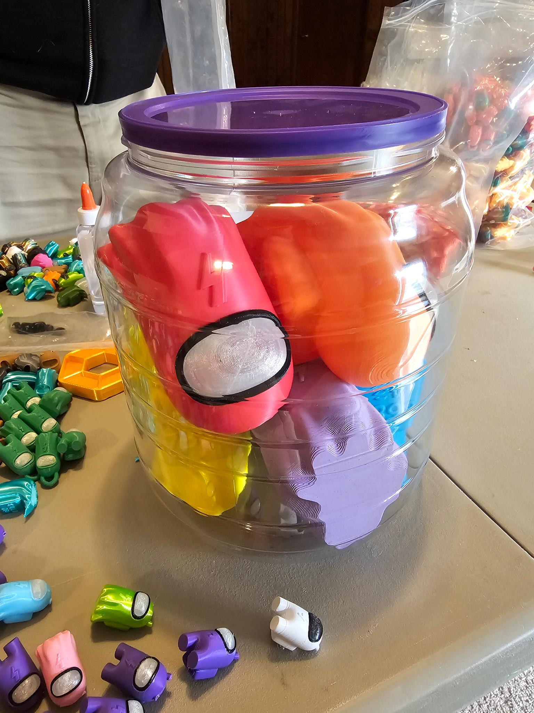

# guess-and-photo-booth

## About

This app was written for [FTC team 7393 eV](https://github.com/FTC7393/) for their pit area at worlds. The idea is that people walk up to this app running on a screen, and they can use either the photo booth and/or the "guess how many among us in the jar" game.

(that was not the final configuration of the jar by the way :)

## Tech Stack
This project uses what I like to call `weird stuff on the backend™` that only happened to work with python. For example, sending the photo booth images by text required a working XMPP library, which surprisingly nodejs would not give me. So the [backend](app.py) is python flask and socketio, the [frontend](templates/index.html) is vuejs and vanilla css and pressure.js, and the "database" is a folder for each user with a JSON file in it. NoSQL at its finest! It also sends the photos to us (with consent of the user) thru a discord webhook.

I was going to deploy it with docker, but decided to just rsync it over to a raspberry pi and run it as a systemd service. The display was a huion kamvas pro 13 drawing tablet with a pen for people to sign their photos if they wanted, which in hindsight didn't run very smoothly on the pi, a laptop would have been better to plug it into. Significantly more janky than last year's [sussy factory](https://github.com/FTC7393/sussy-factory). Ehhhh, now that I think about it, that one was svelte without svelte-kit, which was pretty cursed. These apps were made in a matter of days, usually learning new tech, so give us a break.

## Popularity
The photo booth/guessing game was a hit, with exactly 64 photos taken and 727 guesses made, with 7 of those being correct. That means we have more users than 99% of projects on github (source: i made it up). Thus continues the tradition of making teriible code that works and people enjoy using, and telling ourselves that we will rewrite it later.

## Brainstorming
 - photo booth and guessing game
 - at start, 2 things visible: camera and guess box
 - image taken -> shows up on tablet page for drawing a note
 	- email/phone box enabled to recieve the image, or scan QR to download
 - guess entered -> submit button enabled, onclick -> guess & button disabled
 	- congrats box shown if correct and sound played
 	- show how many they won based on how close
 - done button -> new user

 - admin page:
 	- show/change how many amogus in jar
 	- view users

 - extra features:
 	- cut out camera background and put an among us peeking out
